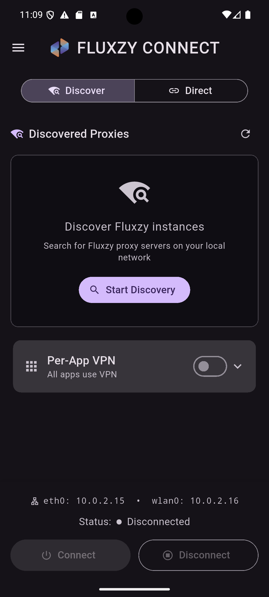

# Fluxzy Connect

A Flutter application that routes Android device traffic through a SOCKS5 proxy via a local VPN tunnel.

<a href="https://play.google.com/store/apps/details?id=io.fluxzy.mobile.connect">
  
</a>

## Screenshot

<p align="center">
  
</p>

## Requirements

- Flutter 3.32.0 or later
- Dart SDK 3.8.0 or later
- Android SDK (API 24+)
- Java 17 (for Android builds)

## Building

Install dependencies:

```bash
flutter pub get
```

Run on a connected device:

```bash
flutter run
```

Build release APK:

```bash
flutter build apk --release
```

## Features

- mDNS autodiscovery for Fluxzy proxy instances
- Manual SOCKS5 proxy configuration
- SOCKS5 authentication support
- Per-app VPN filtering
- HTTP/3 (QUIC) blocking option
- Certificate download from proxy server

## License

Apache License 2.0. See [LICENSE](LICENSE) for details.
